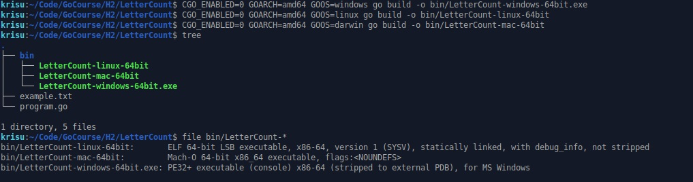
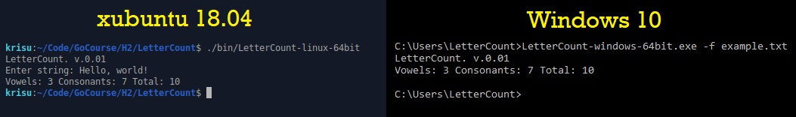

## Go Course exercises
This repository is to store exercises done for [Tero Karvinen's Go Programming](http://terokarvinen.com/2020/go-programming-course-2020-w22/#laksyt) course.

### H2
>a) LinWinMac! Käännä ohjelma kolmelle alustalle: Windows, Linux, Mac. Tee staattinen käännös niin, että ohjelma toimii ilman mitään riippuvuuksia tai kirjastoja. Testaa ohjelman toiminta ainakin joillain näistä alustoista ja ota ruutukaappaukset. 'CGO_ENABLED=0 GOARCH=amd64 GOOS=windows go build tero.go' (GOOS darwin, windows, linux)

Käännetään staattinen 64-bittinen binääri kolmelle alustalle.

Ajetaan ohjelma Linux ja Windows -käyttöjärjestelmillä.

>b) Kirjastoja kohti. Kirjoita ohjelma, joka käyttää kahta uutta ominaisuutta tai kirjastoa Go by Example-kirjasta. Voit valita mitä vain, helppoja vaihtoehtoja ovat esimerkiksi satunnaisluvut, merkkijonojen käsittely ja aika.

>c) Vapaaehtoinen: Patterit mukana. Vapaaehtoinen: kirjoita ohjelma, joka käyttää jotain uutta ominaisuutta Go:n standardikirjastoista.

[LetterCount](LetterCount/program.go) 
Ohjelma joka laskee vokaalit ja konsonantit syötetystä tekstistä.
-f parametrilla voidaan antaa tiedosto.
~~~~
$ ./LetterCount-linux-64bit 
Enter string: Ääkkösiä ja ruotsalainen Å
Vowels: 13 Consonants: 10 Total: 23
$ cat example.txt 
Vesihiisi sihisi hississä # 11, 12, 23

!?:))##!?")=!¤/!=163584213--__$$ # 0
$ ./LetterCount-linux-64bit -f example.txt 
Vowels: 11 Consonants: 12 Total: 23
~~~~

[AgeCalc](AgeCalc/program.go) 
(Työn alla) Idea: Ohjelma joka tulee ottamaan vastaan henkilötietoja (nimi, syntymäaika), laskee iän ja tulostaa.

Tällä hetkellä ottaa vastaan nimen ja syntymäajan, ja esittää ne
~~~~
$ go run program.go 
Syötä henkilön nimi: Aarne
Syötä henkilön syntymäpäivä (muodossa DD.MM.YYYY): 02.06.1985
Nimi: Aarne
Syntymäpäivä: 1985 June 2
~~~~

>e) Vapaaehtoinen: Kirjoita yksikkötesti (unit test).
